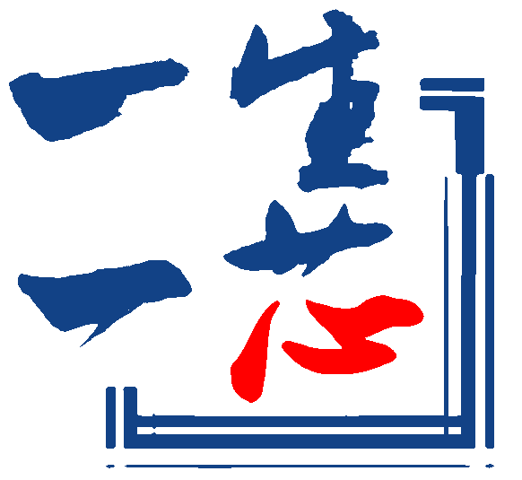

### Hi there 👋
<div align="center">
  
  
</div>

- 🌱 I’m currently learning Chip Design flow and Compiler Theory.
- 💻 See [i.emin.chat](https://i.emin.chat) for more information
- ❤️ Sponsor me: [Emin](https://patreon.com/Emin017)
## ⚡ Skills
<div align="center">

[]()
[]()
[]()
[]()
[]()
[]()
[](#)
[]()
[]()
[]()
[]()
[]()
<br>
 
 

</div>

## 📊 Weekly development
<!--START_SECTION:waka-->

```rust
From: 07 August 2025 - To: 14 August 2025

Total Time: 19 hrs 15 mins

Text                            ████▓░░░░░░░░░░░░░░░░░░░░   18.51 %
Bash                            ████▒░░░░░░░░░░░░░░░░░░░░   17.81 %
Docker                          ███▓░░░░░░░░░░░░░░░░░░░░░   14.33 %
Python                          ███▓░░░░░░░░░░░░░░░░░░░░░   14.11 %
JSON                            █▓░░░░░░░░░░░░░░░░░░░░░░░   06.75 %
Tcl                             █▒░░░░░░░░░░░░░░░░░░░░░░░   05.84 %
V                               ▓░░░░░░░░░░░░░░░░░░░░░░░░   03.08 %
TOML                            ▓░░░░░░░░░░░░░░░░░░░░░░░░   02.42 %
Nix                             ▒░░░░░░░░░░░░░░░░░░░░░░░░   01.89 %
```

<!--END_SECTION:waka-->

## 📫 Contacts
Mail: [&#99;&#99;&#104;&#117;&#113;&#105;&#109;&#110;&#103;&#64;&#103;&#109;&#97;&#105;&#108;&#46;&#99;&#111;&#109;](mailto:&#99;&#99;&#104;&#117;&#113;&#105;&#109;&#110;&#103;&#64;&#103;&#109;&#97;&#105;&#108;&#46;&#99;&#111;&#109;) or [&#109;&#101;&#64;&#101;&#109;&#105;&#110;&#46;&#99;&#104;&#97;&#116;](mailto:&#109;&#101;&#64;&#101;&#109;&#105;&#110;&#46;&#99;&#104;&#97;&#116;)
